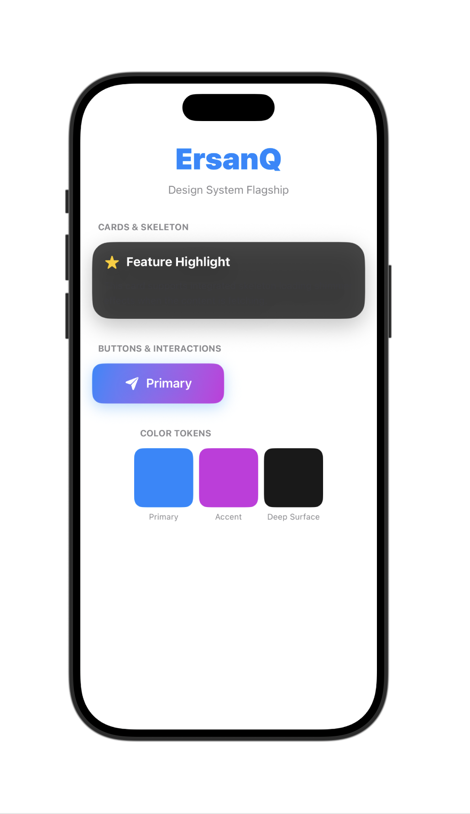

# DesignSystemKit

The official ErsanQ Design System. A flagship collection of premium, unified UI components for modern SwiftUI applications.



## Overview
**DesignSystemKit** provides a cohesive set of UI components, styles, and themes. It bridges the gap between individual utility kits (like GlassKit and SkeletonUI) by offering a unified aesthetic that feels consistent, modern, and high-end.

## Features
- **Unified Tokens**: Centralized colors, gradients, and spacing.
- **ErsanButton**: High-performance button with integrated glassmorphism, spring-physics animations, and haptic feedback.
- **ErsanCard**: Robust container with built-in support for glass effects and shimmer skeleton loading.
- **Interactive Experience**: Every component is designed to feel "alive" with micro-animations and tactile feedback.
- **No Boilerplate**: Plug-and-play components that work instantly on iOS 14+ and macOS 11+.

## Supported Platforms
- iOS 14.0+
- macOS 11.0+

## Installation

```swift
.package(url: "https://github.com/ErsanQ/DesignSystemKit", from: "1.0.0")
```

## Usage

### Using Unified Components
```swift
import DesignSystemKit

VStack {
    ErsanCard(isLoading: $status.isFetching) {
        VStack {
            Text("Premium Content")
            ErsanButton("Get Started") {
                print("Action Triggered")
            }
        }
    }
}
```

### Accessing Design Tokens
```swift
Text("Design System")
    .foregroundColor(Ersan.Color.primary)
    .padding(Ersan.Spacing.medium)
```

## License
MIT License.

## Author
ErsanQ (Swift Package Index Community)
